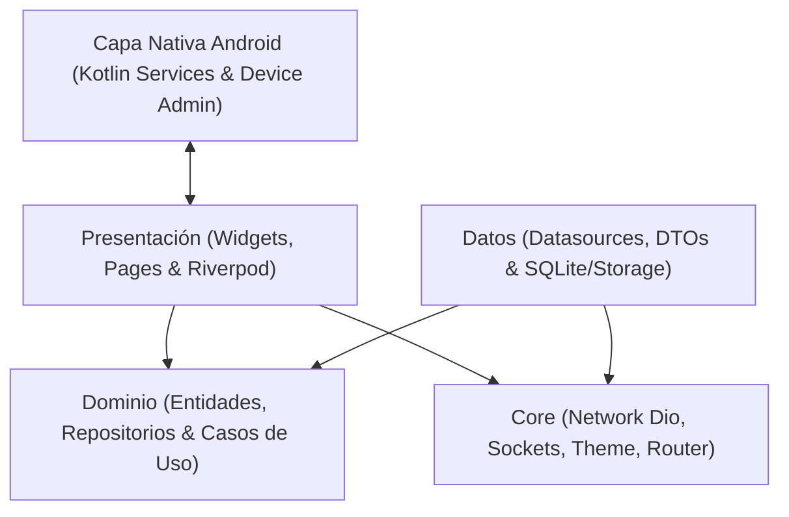
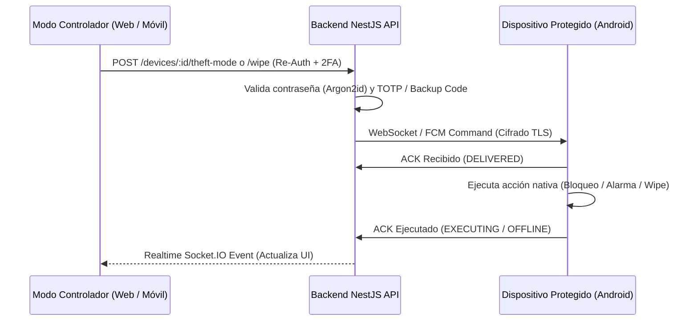

# Guardian Mobile - Client Frontend

Sistema legítimo de seguridad, telemetría y protección antirrobo remota para Android, construido con Flutter, Riverpod y Clean Architecture.

---

## 🏛️ Arquitectura del Sistema

El cliente frontend implementa Clean Architecture dividida por capas y capacidades modulares:



### Flujo de Órdenes y Respaldo Criptográfico



---

## 🔒 Auditoría de Permisos de Android (`AndroidManifest.xml`)

| Permiso | Propósito | Funcionalidad |
| :--- | :--- | :--- |
| `INTERNET` | Comunicación HTTP/REST con el backend y sockets WebSocket | Toda la aplicación |
| `POST_NOTIFICATIONS` | Notificaciones en tiempo real en Android 13+ | Notificaciones persistentes y alertas de comandos |
| `FOREGROUND_SERVICE` | Ejecución de servicios en segundo plano con notificación activa | Rastreo continuo y sirena |
| `FOREGROUND_SERVICE_LOCATION` | Servicio continuo de rastreo satelital/red | Rastreo periódico y Modo Robo |
| `FOREGROUND_SERVICE_MEDIA_PLAYBACK`| Reproducción persistente de sirena de máxima intensidad | Comando "Hacer sonar" y alarma Modo Robo |
| `ACCESS_FINE_LOCATION` | Obtención de coordenadas GPS de alta precisión | Localización bajo demanda y rastreo |
| `ACCESS_COARSE_LOCATION` | Localización aproximada por torres celulares y Wi-Fi | Respaldo en interiores con bajo consumo |
| `ACCESS_BACKGROUND_LOCATION` | Lectura de ubicación periódica cuando la pantalla está apagada | Modo Robo y reporte programado |
| `WAKE_LOCK` | Mantener procesador activo durante ejecución de órdenes críticas | Alarma, bloqueo y borrado remoto |
| `VIBRATE` | Accionamiento del motor háptico del teléfono | Comando "Vibrar" |
| `RECEIVE_BOOT_COMPLETED` | Reactivar servicios de reporte al reiniciar el teléfono | Daemon de fondo |
| `REQUEST_IGNORE_BATTERY_OPTIMIZATIONS`| Evitar que el sistema mate el servicio de ubicación | Resiliencia operativa |
| `BIND_DEVICE_ADMIN` | Permisos de Administrador de Dispositivos (`DevicePolicyManager`) | Bloqueo remoto forzado y Borrado remoto de fábrica (`wipeData`) |

---

## 🛡️ Autenticación en Dos Pasos (2FA / TOTP) y Salvaguardas

- **TOTP y Códigos de Respaldo**: Soporta configuración de secret con códigos QR (`qr_flutter`) y manual, más 10 códigos únicos de respaldo.
- **Doble Salvaguarda en Acciones Críticas**:
  - **Borrado Remoto (`Wipe`)**: Requiere checklist en 4 pasos, escritura exacta de la palabra `BORRAR`, contraseña maestra y token 2FA (si está habilitado).
  - **Desactivación de Modo Robo**: Requiere contraseña maestra y token 2FA activo.
- **Gestión de Sesiones**: Lista completa de sesiones activas con revocación individual y revocación total ("Cerrar todas las sesiones").

---

## ⚙️ Conexión al Backend según el entorno

El backend URL se puede inyectar en compilación o cambiar dinámicamente desde la pantalla de Ajustes:

### 1. Dispositivo físico Android conectado por USB
```powershell
adb reverse tcp:3000 tcp:3000
flutter run -d <DEVICE_ID> --dart-define=API_BASE_URL=http://localhost:3000
```

### 2. Emulador Android
```powershell
flutter run -d emulator-5554 --dart-define=API_BASE_URL=http://10.0.2.2:3000
```

### 3. Red Local / LAN IP (Wi-Fi)
```powershell
flutter run --dart-define=API_BASE_URL=http://192.168.1.X:3000
```

---

## 📦 Compilación para Release (Producción)

### 1. Configuración de Firma
Copia la plantilla `android/key.properties.example` a `android/key.properties` y completa tus credenciales:
```properties
storePassword=tu_password_del_keystore
keyPassword=tu_password_del_alias
keyAlias=guardian_release_key
storeFile=../guardian-release.jks
```
*(Nota: `key.properties` y los archivos `.jks` están ignorados por `.gitignore` y nunca deben subirse al repositorio).*

### 2. Generar APK de Release
```powershell
flutter build apk --release --dart-define=API_BASE_URL=https://api.tudominio.com
```
El archivo compilado se generará en `build/app/outputs/flutter-apk/app-release.apk`.

---

## 🧪 Pruebas y Calidad de Código

### Análisis estático:
```powershell
flutter analyze
```

### Suite de pruebas unitarias y de widgets:
```powershell
flutter test
```

---

## 📱 Limitaciones Actuales y Hoja de Ruta

- **Modo Protegido nativo**: Actualmente exclusivo para dispositivos Android debido al uso de APIs de `DevicePolicyManager` y servicios Foreground específicos del sistema operativo.
- **Soporte iOS**: Modo Controlador completo disponible para supervisión y envío de órdenes hacia dispositivos Android vinculados.
